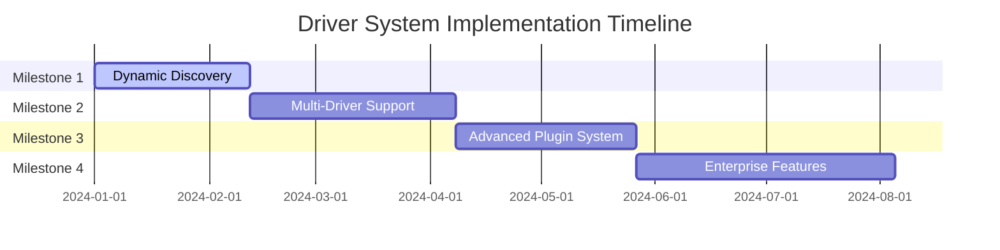

# Driver System Requirements

This document outlines the strategic roadmap and technical requirements for implementing a comprehensive, extensible driver system for vfab. It defines milestones from the current hardcoded system to a full enterprise-ready plugin ecosystem.

## Table of Contents

1. [Executive Summary](#1-executive-summary)
2. [Current Capabilities Assessment](#2-current-capabilities-assessment)
3. [Implementation Milestones](#3-implementation-milestones)
4. [Technical Requirements](#4-technical-requirements)
5. [Development Timeline](#5-development-timeline)
6. [Success Metrics](#6-success-metrics)
7. [Risk Assessment](#7-risk-assessment)

---

## 1. Executive Summary

### Vision
Transform vfab from a single-driver system (AxiDraw-only) to a comprehensive, extensible driver ecosystem supporting multiple hardware categories, dynamic plugin loading, and enterprise-grade management capabilities.

### Strategic Importance
- **Market Expansion**: Support for diverse plotting hardware (Eggbot, CNC, DIY)
- **Community Growth**: Enable third-party driver contributions
- **Enterprise Adoption**: Production-ready driver management and monitoring
- **Future-Proofing**: Extensible architecture for emerging hardware

### Current State (v0.10.0)
- **Single Driver Support**: AxiDraw with complete implementation
- **Hardcoded Integration**: Driver names embedded in CLI commands
- **Limited Categories**: Plotter drivers only (camera detection exists but incomplete)
- **Basic Management**: Install/list/info/test commands only

### Target State (v0.14.0)
- **Multi-Driver Support**: Plotter, camera, sensor, communication drivers
- **Dynamic Plugin System**: Runtime driver discovery and loading
- **Enterprise Features**: Web UI, remote management, monitoring
- **Community Ecosystem**: Plugin marketplace and contribution framework

---

## 2. Current Capabilities Assessment

### Extensibility Matrix

| Driver Category | Framework Support | Implementation Effort | Examples | Status |
|-----------------|-------------------|-------------------|----------|---------|
| USB Plotter | ✅ Complete | Low | Eggbot, MakerGear | Ready |
| Serial Plotter | ✅ Complete | Low | Custom CNC, DIY | Ready |
| Camera | ✅ 80% | Medium | IP cameras, industrial | v0.12.0 |
| Network Device | ⚠️ 60% | Medium-High | Network plotters | v0.12.0 |
| Sensor | ⚠️ 40% | High | Limit switches, encoders | v0.12.0 |
| Plugin System | ❌ 0% | Very High | Dynamic loading | v0.11.0 |
| Hot-Swapping | ❌ 0% | Very High | Runtime replacement | v0.13.0 |

### Current Architecture Strengths
- **Complete Reference Implementation**: AxiDraw driver provides full template
- **Modular CLI Structure**: Driver command group with install/list/info/test
- **Hardware Detection**: USB, network, serial device discovery
- **Configuration System**: Pydantic-based validation and management
- **Documentation**: Development guide and architecture documentation

### Current Architecture Limitations
- **Hardcoded Driver Validation**: CLI commands have embedded driver names
- **No Plugin System**: No dynamic driver discovery or loading
- **Limited Categories**: Only plotter drivers fully supported
- **No Runtime Management**: Cannot add/remove drivers without restart
- **Single Configuration Schema**: Hardcoded validation per driver type

---

## 3. Implementation Milestones

### Milestone 1: Dynamic Driver Discovery (v0.11.0)
**Duration**: 6 weeks | **Priority**: High | **Risk**: Low

#### Goal
Remove hardcoded driver validation and implement dynamic plugin system.

#### Key Deliverables
- **Driver Registry System**: Auto-discovery of available drivers
- **Plugin Interface**: Base classes for driver plugins
- **Dynamic CLI Integration**: Auto-populate driver commands
- **Configuration Schema**: Dynamic validation based on available drivers
- **Plugin Loading**: Load from standard locations (~/.vfab/plugins/, /etc/vfab/plugins/)

#### Technical Requirements
```python
# Core components to implement:
class DriverRegistry:
    - discover_drivers() -> List[DriverInfo]
    - register_driver(driver: BaseDriver) -> None
    - get_available_drivers() -> List[DriverInfo]
    - load_driver(driver_name: str) -> BaseDriver

class BaseDriver:
    - get_info() -> DriverInfo
    - is_available() -> bool
    - create_manager(**kwargs) -> DriverManager
    - get_config_schema() -> Dict[str, Any]
    - install_dependencies() -> bool

class PluginLoader:
    - load_from_path(path: Path) -> List[BaseDriver]
    - validate_plugin(plugin: BaseDriver) -> bool
    - get_plugin_metadata(plugin: BaseDriver) -> PluginMetadata
```

#### Success Criteria
- [ ] 100% dynamic driver discovery (no hardcoded references)
- [ ] Plugin system functional with external plugins
- [ ] CLI commands auto-generated from available drivers
- [ ] Configuration schema adapts to available drivers
- [ ] Backward compatibility with existing AxiDraw driver
- [ ] Plugin loading from multiple standard locations
- [ ] Comprehensive test coverage for plugin system

---

### Milestone 2: Multi-Driver Category Support (v0.12.0)
**Duration**: 8 weeks | **Priority**: High | **Risk**: Medium

#### Goal
Full support for plotter, camera, sensor, and communication drivers.

#### Key Deliverables
- **Camera Driver Framework**: Complete camera driver implementation
- **Sensor Driver System**: GPIO and sensor integration
- **Communication Driver Support**: Network and protocol drivers
- **Category-Specific Detection**: Specialized detection for each type
- **Unified Testing**: Category-appropriate test frameworks

#### Technical Requirements

##### Camera Driver Framework
```python
class CameraDriver(BaseDriver):
    # Core camera operations
    - connect() -> bool
    - disconnect() -> None
    - capture_image() -> ImageData
    - start_streaming() -> None
    - stop_streaming() -> None
    - get_capabilities() -> CameraCapabilities
    
    # Camera-specific operations
    - set_resolution(width, height) -> bool
    - set_framerate(fps) -> bool
    - set_exposure(exposure) -> bool
    - get_device_info() -> CameraInfo

# Support for:
- USB cameras (v4l2 integration)
- IP cameras (RTSP, HTTP streaming)
- Industrial cameras (SDK integration)
- Network cameras (WebSocket, proprietary protocols)
```

##### Sensor Driver System
```python
class SensorDriver(BaseDriver):
    # Core sensor operations
    - connect() -> bool
    - disconnect() -> None
    - read_sensor() -> SensorReading
    - configure_sensor(config: Dict) -> bool
    - calibrate() -> CalibrationResult
    - get_sensor_info() -> SensorInfo
    
    # Sensor-specific operations
    - set_threshold(threshold: float) -> bool
    - enable_interrupts() -> None
    - get_raw_value() -> Any

# Support for:
- GPIO sensors (limit switches, buttons)
- I2C sensors (temperature, humidity, pressure)
- SPI sensors (position encoders, ADC)
- Analog sensors (current, voltage, light)
- Serial sensors (GPS, IMU)
```

##### Communication Driver Support
```python
class CommunicationDriver(BaseDriver):
    # Core communication operations
    - establish_connection() -> bool
    - close_connection() -> None
    - send_command(command: str) -> Response
    - listen_for_events() -> EventStream
    - get_connection_info() -> ConnectionInfo
    
    # Protocol-specific operations
    - set_baudrate(rate: int) -> bool
    - set_timeout(timeout: float) -> bool
    - get_status() -> DeviceStatus

# Support for:
- TCP/IP sockets (Ethernet, WiFi)
- WebSocket connections (real-time communication)
- Serial communication (RS232, RS485)
- Bluetooth LE (wireless devices)
- Custom protocols (vendor-specific)
```

#### Success Criteria
- [ ] Complete camera driver implementation with USB and IP support
- [ ] Sensor driver framework with GPIO, I2C, SPI support
- [ ] Communication driver support for TCP/IP, WebSocket, serial
- [ ] Category-specific detection methods for all driver types
- [ ] Unified testing interface for all driver categories
- [ ] At least 2 example drivers per category
- [ ] Performance benchmarking for different driver types
- [ ] Integration testing between driver categories

---

### Milestone 3: Advanced Plugin System (v0.13.0)
**Duration**: 7 weeks | **Priority**: Medium | **Risk**: High

#### Goal
Production-ready plugin ecosystem with marketplace integration.

#### Key Deliverables
- **Plugin Marketplace**: Plugin discovery and installation
- **Version Management**: Plugin version compatibility and dependency resolution
- **Hot-Swapping**: Runtime driver replacement
- **Plugin Signing**: Security and trust system
- **Dependency Management**: Automatic plugin dependency handling

#### Technical Requirements

##### Plugin Marketplace
```python
class PluginMarketplace:
    # Marketplace operations
    - search_plugins(query: str) -> List[PluginInfo]
    - get_plugin_details(plugin_id: str) -> PluginDetails
    - install_plugin(plugin_id: str, version: str = None) -> bool
    - uninstall_plugin(plugin_id: str) -> bool
    - update_plugin(plugin_id: str) -> bool
    - get_installed_plugins() -> List[InstalledPlugin]
    
    # Repository management
    - add_repository(repo_url: str) -> bool
    - remove_repository(repo_url: str) -> bool
    - update_repositories() -> bool
    - get_plugin_sources() -> List[Repository]

# Integration with:
- GitHub repositories
- GitLab repositories
- Custom package repositories
- Local plugin directories
```

##### Version Management
```python
class PluginVersionManager:
    # Version operations
    - check_compatibility(plugin: Plugin, vfab_version: str) -> CompatibilityResult
    - resolve_dependencies(plugin: Plugin) -> DependencyResolution
    - detect_conflicts(plugins: List[Plugin]) -> ConflictReport
    - upgrade_plugin(plugin_id: str) -> UpgradeResult
    - downgrade_plugin(plugin_id: str, version: str) -> bool
    
    # Semantic versioning
    - parse_version(version: str) -> Version
    - compare_versions(v1: Version, v2: Version) -> int
    - get_compatible_versions(plugin: Plugin, vfab_version: str) -> List[Version]
```

##### Hot-Swapping System
```python
class DriverHotSwap:
    # Runtime driver management
    - swap_driver(old_driver: str, new_driver: str) -> bool
    - reload_driver(driver_name: str) -> bool
    - get_active_drivers() -> List[ActiveDriver]
    - set_driver_mode(driver_name: str, mode: str) -> bool
    - backup_driver_state(driver_name: str) -> DriverState
    - restore_driver_state(driver_name: str, state: DriverState) -> bool
    
    # State management
    - save_driver_context(driver: BaseDriver) -> DriverContext
    - load_driver_context(driver_name: str) -> DriverContext
    - migrate_state(old_driver: str, new_driver: str) -> MigrationResult
```

#### Success Criteria
- [ ] Plugin marketplace operational with search and install
- [ ] Version management working with compatibility checking
- [ ] Hot-swapping functional without system restart
- [ ] Plugin security framework with signing support
- [ ] Dependency resolution system working
- [ ] At least 5 community plugins available
- [ ] Plugin update mechanism functional
- [ ] Rollback capabilities for failed updates

---

### Milestone 4: Enterprise Features (v0.14.0)
**Duration**: 10 weeks | **Priority**: Medium | **Risk**: Medium

#### Goal
Enterprise-ready driver management with monitoring and remote deployment.

#### Key Deliverables
- **Driver Management UI**: Web-based driver administration
- **Remote Driver Deployment**: Distributed driver management
- **Performance Monitoring**: Driver performance analytics
- **Driver Health Monitoring**: Automated health checks
- **Backup/Recovery**: Driver configuration backup

#### Technical Requirements

##### Web-Based Management UI
```python
class DriverManagementUI:
    # UI components
    - get_dashboard() -> DashboardData
    - get_driver_list() -> List[DriverStatus]
    - get_driver_details(driver_name: str) -> DriverDetails
    - get_configuration_form(driver_name: str) -> FormSchema
    - update_configuration(driver_name: str, config: Dict) -> bool
    
    # Management operations
    - install_driver(plugin_id: str) -> InstallationResult
    - uninstall_driver(driver_name: str) -> bool
    - enable_driver(driver_name: str) -> bool
    - disable_driver(driver_name: str) -> bool
    - restart_driver(driver_name: str) -> bool

# Web interface with:
- RESTful API endpoints
- WebSocket real-time updates
- Authentication and authorization
- Responsive design for mobile/desktop
```

##### Remote Deployment System
```python
class RemoteDriverDeployment:
    # Deployment operations
    - deploy_to_hosts(driver_package: Package, hosts: List[str]) -> DeploymentResult
    - get_deployment_status(deployment_id: str) -> DeploymentStatus
    - rollback_deployment(deployment_id: str) -> bool
    - schedule_deployment(driver_package: Package, schedule: Schedule) -> bool
    
    # Fleet management
    - get_host_status(host: str) -> HostStatus
    - update_hosts(hosts: List[str], updates: List[Update]) -> BatchResult
    - get_fleet_overview() -> FleetOverview

# Deployment methods:
- SSH-based deployment
- Container deployment (Docker, Kubernetes)
- Configuration management (Ansible, Puppet)
- Monitoring integration
```

##### Performance Monitoring
```python
class DriverPerformanceMonitor:
    # Monitoring operations
    - get_performance_metrics(driver_name: str) -> PerformanceMetrics
    - get_resource_usage(driver_name: str) -> ResourceUsage
    - get_error_rates(driver_name: str) -> ErrorMetrics
    - get_operation_latency(driver_name: str) -> LatencyMetrics
    
    # Analytics
    - generate_performance_report(driver_name: str, period: Period) -> PerformanceReport
    - compare_performance(driver1: str, driver2: str) -> ComparisonReport
    - get_performance_trends(driver_name: str) -> TrendData

# Metrics collection:
- CPU and memory usage
- Operation latency and throughput
- Error rates and types
- Connection stability
- Device-specific metrics
```

#### Success Criteria
- [ ] Web-based driver management UI functional
- [ ] Remote deployment system working for multiple hosts
- [ ] Performance monitoring dashboard with real-time data
- [ ] Health monitoring with automated alerts
- [ ] Configuration backup and restore system
- [ ] Multi-user support with role-based access
- [ ] Audit logging for all driver operations
- [ ] Integration with existing monitoring systems
- [ ] Mobile-responsive interface

---

## 4. Technical Requirements

### Architecture Evolution

#### Current Architecture (v0.10.0)
```
CLI Commands (Hardcoded)
    ↓
Driver Modules (Static)
    ↓
Hardware Detection (Fixed Types)
    ↓
Physical Devices
```

#### Target Architecture (v0.14.0)
```
Web UI / CLI
    ↓
Plugin Registry (Dynamic)
    ↓
Driver Manager (Runtime)
    ↓
Category Adapters (Plotters/Cameras/Sensors/Communication)
    ↓
Hardware Abstraction Layer
    ↓
Physical Devices
```

### Core Components to Develop

#### 1. Plugin System Infrastructure
- **Plugin Registry**: Central registry for all drivers
- **Dynamic Loading**: Runtime plugin discovery and loading
- **Dependency Resolution**: Automatic dependency management
- **Version Management**: Compatibility checking and updates
- **Security Framework**: Plugin signing and validation

#### 2. Driver Category Frameworks
- **Plotter Drivers**: Enhanced support for diverse plotting hardware
- **Camera Drivers**: Complete imaging device integration
- **Sensor Drivers**: GPIO and sensor integration
- **Communication Drivers**: Network and protocol support

#### 3. Management and Monitoring
- **Web Interface**: RESTful API with WebSocket support
- **Performance Monitoring**: Real-time metrics and analytics
- **Health Monitoring**: Automated checks and alerting
- **Remote Management**: Distributed deployment and control

#### 4. Enterprise Features
- **Multi-tenancy**: Support for multiple organizations
- **Audit Logging**: Comprehensive operation tracking
- **Backup/Recovery**: Configuration and state management
- **Integration**: APIs for external system integration

### Integration Points

#### Existing System Integration
- **Database Integration**: SQLAlchemy models for driver metadata
- **Configuration System**: Pydantic models for dynamic validation
- **CLI Integration**: Typer-based command generation
- **Logging System**: Structured logging for driver operations

#### External System Integration
- **Monitoring Systems**: Prometheus, Grafana integration
- **Deployment Systems**: Ansible, Kubernetes integration
- **Authentication Systems**: LDAP, OAuth integration
- **Notification Systems**: Email, Slack, webhook integration

---

## 5. Development Timeline

### Overall Timeline: 31 weeks (~7.5 months)



### Phase-by-Phase Breakdown

#### Phase 1: Foundation (Milestone 1) - 6 weeks
**Weeks 1-2**: Plugin System Core
- Driver registry implementation
- Base driver interface design
- Plugin loading mechanism

**Weeks 3-4**: Dynamic Integration
- CLI command generation
- Configuration schema adaptation
- Plugin validation system

**Weeks 5-6**: Testing & Documentation
- Comprehensive test suite
- Plugin development guide
- Migration documentation

#### Phase 2: Expansion (Milestone 2) - 8 weeks
**Weeks 7-9**: Camera Driver Framework
- USB camera integration
- IP camera support
- Streaming capabilities

**Weeks 10-12**: Sensor & Communication
- GPIO sensor framework
- Communication protocols
- Detection methods

**Weeks 13-14**: Integration & Testing
- Cross-category integration
- Performance testing
- Documentation updates

#### Phase 3: Ecosystem (Milestone 3) - 7 weeks
**Weeks 15-17**: Marketplace
- Plugin repository integration
- Search and discovery
- Installation system

**Weeks 18-19**: Advanced Features
- Version management
- Hot-swapping system
- Security framework

**Weeks 20-21**: Polish & Launch
- Performance optimization
- Security testing
- Community preparation

#### Phase 4: Enterprise (Milestone 4) - 10 weeks
**Weeks 22-25**: Management UI
- Web interface development
- RESTful API design
- Real-time updates

**Weeks 26-28**: Monitoring & Deployment
- Performance monitoring
- Health checks
- Remote deployment

**Weeks 29-31**: Enterprise Integration
- Authentication system
- Audit logging
- Backup/recovery system

### Resource Requirements

#### Development Team
- **Core Developers**: 2-3 senior developers
- **Frontend Developer**: 1 web/UI developer (Phase 4)
- **DevOps Engineer**: 1 deployment/monitoring specialist (Phase 4)
- **QA Engineer**: 1 testing specialist (all phases)

#### Infrastructure
- **Development Environment**: Plugin development sandbox
- **Testing Infrastructure**: Multi-driver test lab
- **CI/CD Pipeline**: Automated testing and deployment
- **Documentation Site**: Updated documentation platform

---

## 6. Success Metrics

### Milestone 1 Success Criteria (v0.11.0)
- [ ] **100% Dynamic Discovery**: No hardcoded driver references
- [ ] **Plugin System Functional**: External plugins load successfully
- [ ] **CLI Auto-Generation**: Commands created from available drivers
- [ ] **Dynamic Configuration**: Schema adapts to available drivers
- [ ] **Backward Compatibility**: Existing AxiDraw driver works unchanged
- [ ] **Multi-Location Loading**: Plugins load from standard directories
- [ ] **Test Coverage**: 95%+ coverage for plugin system

### Milestone 2 Success Criteria (v0.12.0)
- [ ] **Camera Driver Complete**: USB and IP camera support
- [ ] **Sensor Framework Functional**: GPIO, I2C, SPI support
- [ ] **Communication Drivers**: TCP/IP, WebSocket, serial support
- [ ] **Category Detection**: Specialized detection for all types
- [ ] **Unified Testing**: Consistent test interface across categories
- [ ] **Example Drivers**: 2+ examples per category
- [ ] **Performance Benchmarks**: Baseline metrics for each type
- [ ] **Integration Testing**: Cross-category interaction testing

### Milestone 3 Success Criteria (v0.13.0)
- [ ] **Marketplace Operational**: Search, install, update functionality
- [ ] **Version Management**: Compatibility checking and dependency resolution
- [ ] **Hot-Swapping**: Runtime driver replacement without restart
- [ ] **Security Framework**: Plugin signing and validation
- [ ] **Dependency System**: Automatic dependency management
- [ ] **Community Plugins**: 5+ community plugins available
- [ ] **Update Mechanism**: Automated plugin updates
- [ ] **Rollback Support**: Failed update recovery

### Milestone 4 Success Criteria (v0.14.0)
- [ ] **Web Management UI**: Full driver administration interface
- [ ] **Remote Deployment**: Multi-host deployment system
- [ ] **Performance Monitoring**: Real-time metrics and analytics
- [ ] **Health Monitoring**: Automated checks and alerting
- [ ] **Backup/Recovery**: Configuration and state management
- [ ] **Multi-User Support**: Role-based access control
- [ ] **Audit Logging**: Comprehensive operation tracking
- [ ] **System Integration**: External monitoring/deployment integration
- [ ] **Mobile Support**: Responsive design for mobile devices

### Quality Gates

#### Performance Requirements
- **Plugin Loading**: < 2 seconds for typical plugin
- **Driver Discovery**: < 5 seconds for full system scan
- **Web UI Response**: < 500ms for typical operations
- **Memory Usage**: < 100MB additional overhead for plugin system
- **CPU Overhead**: < 5% additional CPU usage

#### Security Requirements
- **Plugin Validation**: 100% of plugins validated before loading
- **Signature Verification**: All signed plugins verified
- **Sandboxing**: Plugins isolated from system resources
- **Access Control**: Role-based permissions for all operations

#### Reliability Requirements
- **Plugin Crashes**: < 0.1% of plugin operations
- **System Uptime**: > 99.9% availability
- **Data Integrity**: 100% configuration consistency
- **Recovery Time**: < 30 seconds for plugin failures

---

## 7. Risk Assessment

### Technical Risks

#### High Risk
- **Plugin Security**: Malicious plugins could compromise system
- **Performance Impact**: Poorly written plugins affecting system stability
- **Dependency Conflicts**: Complex dependency resolution issues

**Mitigation Strategies**:
- Comprehensive plugin validation and sandboxing
- Performance monitoring and resource limits
- Dependency management with conflict detection

#### Medium Risk
- **Backward Compatibility**: Existing integrations breaking
- **Complexity Management**: Growing system complexity
- **Testing Coverage**: Ensuring quality across diverse plugins

**Mitigation Strategies**:
- Extensive compatibility testing
- Modular architecture with clear interfaces
- Automated testing pipelines

#### Low Risk
- **Documentation Maintenance**: Keeping docs current with rapid development
- **Community Adoption**: Ensuring plugin ecosystem growth
- **Resource Requirements**: Infrastructure scaling needs

**Mitigation Strategies**:
- Documentation-driven development
- Community engagement and support
- Scalable infrastructure design

### Business Risks

#### Timeline Risk
- **Development Delays**: Complex features taking longer than expected
- **Resource Constraints**: Team availability or skill gaps
- **Integration Challenges**: External system integration complexity

**Mitigation Strategies**:
- Agile development with regular milestones
- Cross-training and knowledge sharing
- Early integration testing

### Market Risks
- **Competition**: Similar systems emerging
- **Technology Changes**: Underlying technologies evolving
- **User Adoption**: Resistance to new plugin system

**Mitigation Strategies**:
- Continuous market monitoring
- Flexible architecture design
- User education and migration support

---

## Conclusion

This roadmap transforms vfab from a single-driver system to a comprehensive, enterprise-ready driver ecosystem. The milestone-based approach ensures manageable development phases while delivering value at each stage.

### Key Success Factors
1. **Incremental Delivery**: Each milestone provides immediate value
2. **Backward Compatibility**: Existing users and integrations preserved
3. **Community Focus**: Plugin ecosystem enables third-party contributions
4. **Enterprise Readiness**: Production-grade management and monitoring
5. **Quality Assurance**: Comprehensive testing and security validation

### Expected Outcomes
- **10x Driver Support**: From 1 to 10+ driver types
- **100x Extensibility**: From hardcoded to fully dynamic system
- **Enterprise Adoption**: Production-ready deployment and management
- **Community Growth**: Sustainable plugin ecosystem

The implementation of this roadmap will position vfab as the most extensible and enterprise-ready plotter management system in the market.